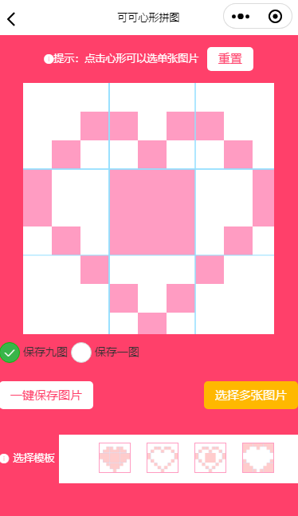

# 可可心形拼图之心形拼图微信小程序

   可可心形拼图之心形拼图，点击心形可以选择图片，一键保存9️九图或者一图，多种模板选择。

 

   扫描微信小程序码或搜索“可可心形拼图”，选择心形拼图，体验该小程序。

## 使用代码

  1. 下载并安装[微信开发者工具](https://mp.weixin.qq.com/debug/wxadoc/dev/devtools/download.html)，使用微信号扫码登录开发者工具。

  2. 打开微信开发者工具，点击“小程序项目”按钮，输入小程序 AppID，项目目录选择下载的代码目录，点击确定创建小程序项目。

